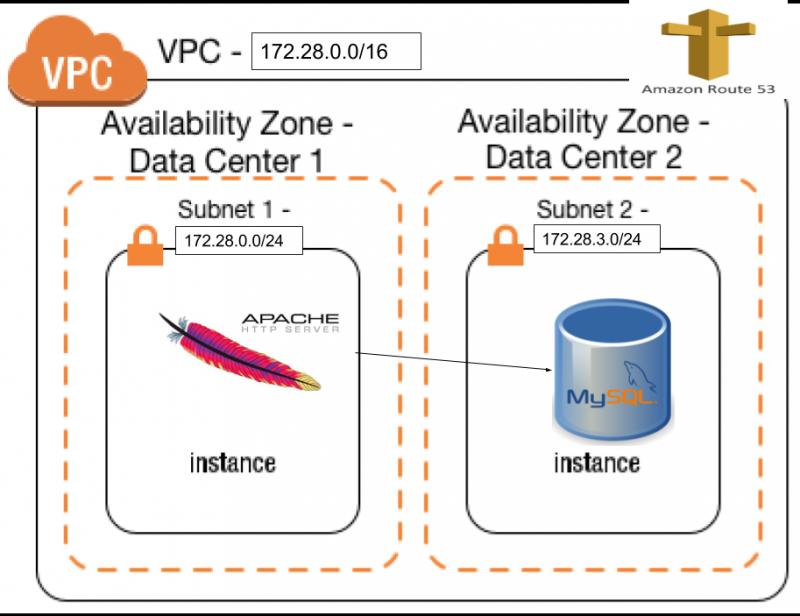

# AWS Complete Environment using Terraform



This AWS environment built using the Terraform automation. We will create everything you need from scratch: VPC, subnets, routes, security groups, an EC2 machine with MySQL installed inside a private network, and a webapp machine with Apache and its PHP module in a public subnet. The webapp machine reads a table in the database and shows the result.

## Prerequisites

There are only 2 prerequisites:

- Having Terraform installed: it is pretty easy to install it if you haven’t already. You can find the instructions in my first article “Introduction to Terraform Modules.”
- If you want to log in to the machines, you need to have an AWS pem key already created in the region of your choice and downloaded on your machine. See how to create a pem key here if you haven’t already.
- AWS Credential( aws_access_key_id and aws_secret_access_key)
- AWS Profile in case you have other AWS accounts.

## The files structure

Terraform elaborates all the files inside the working directory so it does not matter if everything is contained in a single file or divided into many, although it is convenient to organize the resources in logical groups and split them into different files. Let’s take a look at how we can do this effectively:

All variables are defined in the [variable.tf](variables.tf) file. Before you run the the “terraform apply” command, you need to insert your access and secret keys. If you also want to log into the EC2 machine, make sure you fill in the key name as well.

Every variable is of type String, except for the AmiLinux. This particular variable is a map and depends on the content of the region variable. You can add the region you wish to use in the map using the ami-id of the AWS Linux distribution.

In the [network.tf](network.tf) file, we set up the provider for AWS and the VPC declaration. Together with the Route53 configuration, the option specified for the vpc creation enables an internal name resolution for our VPC. As you may be aware, Terraform can be used to build infrastructures for many environments, such as AWS, Azure, Google Cloud, VMware, and many others. A full list is available here: https://www.terraform.io/docs/providers/index.html . In this article, we are using AWS as the provider.

When you start from scratch, you need to attach an internet gateway to your VPC and define a network ACL. There aren’t restriction at network ACL level because the restriction rules will be enforced by security group.

As you can see, there are two routing tables: one for public access, and the other one for private access. In our case, we also need to have access to the internet from the database machine since we use it to install MySQL Server. We will use the AWS NAT Gateway in order to increase our security and be sure that there aren’t incoming connections coming from outside the database. As you can see, defining a NAT gateway is pretty easy since it consists of only four lines of code. It is important, though, to deploy it in a public subnet and associate an elastic ip to it. The depends_on allows us to avoid errors and create the NAT gateway only after the internet gateway is in the available state.

One thing worth noting is that the data called `aws_availability_zones` provide the correct name of the availability zones in the chosen region. This way we don’t need to add letters to the region variable and we can avoid mistakes. For example, the North Virginia region where region b does not exist, and in other regions where there are 2 or 4 AZs.

## Internal DNS and DHCP

In this file [dns-and-dhcp.tf](dns-and-dhcp.tf), three things were accomplished: the private Route53 DNS zone was created, the association with the VPC was made, and the DNS record for the database was created. Terraform perform the actions in the right order, the last component in this file will be the database dns record because it depends on the private ip of the EC2 database machine. This machine will be allocated during the database creation.

## Security

In the file [securitygroups.tf](securitygroups.tf), we have two security groups: one for the web application, and another for the database. They both need to have the outbound (egress) rule to have internet access because yum will install the Apache and MySQL servers, but the connection to the MySQL port will be allowed only from instances that belong to the webapp security group.

I have left the ssh port open only for debug reason, but you can also delete that rule.

## EC2 Instances

We chose an AWS Linux AMI. I loaded the userdata using the HEREDOC option, but you can also use an external file.

### The database machine

This machine is placed in the private subnet and has its security group. The userdata performs the following actions:

- update the OS
- install the MySQL server and run it
- configure the root user to grant access from other machines
- create a table in the test database and add one line inside

### The Webapp machine

It is placed in the public subnet so it is possible to reach it from your browser using port 80. The userdata performs the following actions:

- update the OS
- install the Apache web server and its php module
- start the Apache
- using the echo command place in the public directory, a php file that reads the value inside the database created in the other EC2

### Running the terraform and connect to the application

Create all files with extension .tf inside a directory, replace the values in the [variable.tf](variable.tf) as explained in the beginning of the document, and then run the command:

```bash
terraform apply
```

After a few minutes, the process should be completed and you can go to your AWS web console and read the public ip of your EC2 machine. Visit the url in your browser, and you will see the result of the php command.

```bash
✔ ~/projects/terraform/cout [master|✚ 2]
00:08 $ aws running-instance --profile rbd_sys --region eu-west-2
---------------------------------------------------------------------
|                         DescribeInstances                         |
+----------+---------------+--------------+------------+------------+
|   Name   |    PRI_IP     |   PUB_IP     | Platform   |   Type     |
+----------+---------------+--------------+------------+------------+
|  phpapp  |  172.28.0.73  |  3.10.117.15 |  Linux     |  t2.micro  |
|  database|  172.28.3.220 |  None        |  Linux     |  t2.micro  |
+----------+---------------+--------------+------------+------------+
✔ ~/projects/terraform/cout [master|✚ 2]
00:09 $
```

### Testing the zone

To test your internal DNS routing system, you can log in inside the web server machine to run a DNS query for the private zone like this:

```bash
$ host mydatabase.linuxacademy.internal
mydatabase.linuxacademy.internal has address 172.28.3.142
```

If you try to do it from a machine outside the vpc, you will have:

```bash
host mydatabase.linuxacademy.internal.
Host mydatabase.linuxacademy.internal. not found: 3(NXDOMAIN)
```

#### Issues

There is currently one issue with this setup. The Internale DNS seems not to be working wher trying to access the databese.

#### Todo

- fix the internal DNS with apache and the database
